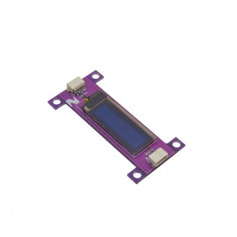

# Qwiic_OLED_128x32

> This product can be available for purchase [here](https://www.smart-prototyping.com/Zio-OLED-Display-0-91-in-128-32-Qwiic.html).

#### Description

This Zio OLED Display features a whopping 128x32 pixels in a small 0.91” (diagonal) frame. That’s 4,000 itsy-bitsy LEDs. [pause for effect]

Speed isn’t compromised however, thanks to its I2C command structure. Your firmware only needs to send the changes that it wants to make, rather than transferring information for every single pixel during each screen update.

As an OLED, it comes with all the perks of being able to emit light (unlike LCDs). No backlight layer here! Therefore, it’s thinner, consumes less power, and has higher contrast. With this size, it can display up to 3 lines of text.

The breakout board also features 4 mounting holes that can be snapped off and 2 Qwiic connectors to allow for quick and easy daisy-chaining.

> Note: As with all of the Version 1.0 Zio Qwiic boards, this board has been produced with the I2C pull-ups disconnected by default. If there's a significant length of wire between this board and your MCU, you'll need to solder closed the solder jumpers (labeled SDA, 3v3 and SCL) to connect the pull-up resistors to VCC.

#### Specification

* Communication Protocols: I2C
* IC: SSD1306
* I2C address: 0x3C
* Dimensions with Mounting  Tab: 25.1x 50.3mm
* Dimension without Mounting  Tab: 50.3x15.1mm
* Weight: 5g

#### Links

* [Adafruit GFX Library](https://github.com/adafruit/Adafruit-GFX-Library)
* [Adafruit SSD1306 Library](https://github.com/adafruit/Adafruit_SSD1306)
* [Demo Code](https://github.com/adafruit/Adafruit_SSD1306/tree/master/examples/ssd1306_128x32_i2c)
* [Eagle files](https://github.com/ZIOCC/Qwiic_OLED_128x32)

> ###### About Zio
> Zio is a new line of open sourced, compact, and grid layout boards, fully integrated for Arduino and Qwiic ecosystem. Designed ideally for wearables, robotics, small-space limitations or other on the go projects. Check out other awesome Zio products [here](https://www.smart-prototyping.com/Zio).

> All Zio products are released under the [Creative Commons Attribution, Share-Alike License](https://creativecommons.org/licenses/by-sa/4.0/), and in accordance with the principles of the [Open Source Hardware Association's OSHW Statement of Principles 1.0 and OSHW Definition 1.0](https://www.oshwa.org/definition/).
